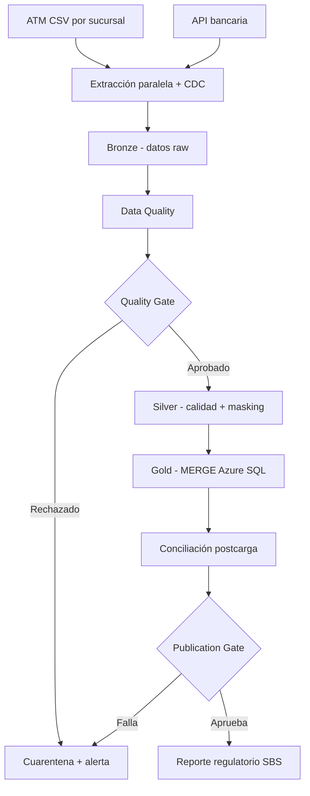

# FinanData TrustGate

Pipeline ETL financiero orquestado con Prefect que evita que un lote con errores llegue a un reporte regulatorio. El proyecto responde al laboratorio de la Semana 3 de IT for Banking: ETL/ELT, DataOps, DAG, calidad, monitoreo, reintentos, idempotencia, backfill y trazabilidad.

## Diferenciador del caso

El incidente original detectaba 15% de transacciones rechazadas, pero seguía ejecutándose y enviaba información incorrecta a la SBS. TrustGate incorpora dos controles obligatorios:

1. **Quality Gate:** separa aceptados y rechazados, envía estos últimos a cuarentena y bloquea el flujo cuando se viola una regla crítica.
2. **Publication Gate:** autoriza el reporte solo después de comprobar conteos y que `Débito = Crédito`.

## Arquitectura lógica



## Qué contiene

```text
finandata-trustgate/
├── flows/pipeline.py              # DAG funcional con Prefect
├── src/                           # CDC, calidad, transformación, lake y Warehouse
├── scripts/generate_data.py       # 300 filas sanas + incidente exacto del 15%
├── scripts/run_demo.py            # Demostración completa y verificaciones
├── scripts/inspect_warehouse.py   # Evidencias finales en tablas
├── tests/                         # Pruebas automáticas
├── sql/                           # Esquema, MERGE y consultas de auditoría
├── docs/                          # Respuestas y guía de exposición
├── prefect.yaml                   # Despliegue programado a las 18:00
└── .github/workflows/ci.yml       # CI en push y pull request
```

## Requisitos e instalación en Windows

Todos los integrantes necesitan Python y **Microsoft ODBC Driver 18 for SQL
Server**. El Warehouse está centralizado en Azure SQL; no se utiliza DuckDB.

Desde PowerShell, dentro de la carpeta del proyecto:

```powershell
py -3.12 -m venv .venv
.\.venv\Scripts\Activate.ps1
python -m pip install --upgrade pip
pip install -r requirements.txt
python scripts/generate_data.py
```

También funciona con Python 3.10, 3.11, 3.12 o 3.13.

## Conexión segura con Azure SQL

Cada integrante crea su propio `.env`; nunca se comparte por GitHub:

```powershell
Copy-Item .env.example .env
```

Completa en `.env`:

```dotenv
AZURE_SQL_SERVER=servidor.database.windows.net
AZURE_SQL_DATABASE=base_de_datos
AZURE_SQL_USERNAME=usuario_sql
AZURE_SQL_PASSWORD=contraseña
```

Además del servidor y contraseña son obligatorios el **nombre de la base de
datos** y el **usuario SQL**. Después prueba credenciales, firewall, permisos y
creación automática del esquema:

```powershell
python scripts/test_azure_connection.py
```

## Demostración recomendada

Ejecuta las pruebas locales y luego la demostración integrada con Azure SQL:

```powershell
pytest
python scripts/run_demo.py
python scripts/inspect_warehouse.py
```

`run_demo.py` vacía primero las cinco tablas del esquema exclusivo
`finandata`; no debe configurarse ese nombre sobre un esquema que contenga datos
ajenos al laboratorio.

El resultado esperado es:

| Ejecución | Resultado |
|---|---|
| `DEMO-HEALTHY-001` | 300 insertados + 300 eventos `INSERT` de auditoría |
| `DEMO-HEALTHY-002` | 300 `REPROCESSED`, sin cambios de negocio ni duplicados |
| `DEMO-INCIDENT-15PCT` | 45/300 rechazados, cero cambios en Gold y reporte bloqueado |

La tercera ejecución termina en estado fallido de manera intencional. No es un error de la demo: demuestra que el control funcionó.

## Ejecuciones individuales

```powershell
python -m flows.pipeline --scenario healthy --force-reprocess
python -m flows.pipeline --scenario incident --force-reprocess
```

Sin `--force-reprocess`, el pipeline utiliza los watermarks de `updated_at` y captura solamente datos nuevos o modificados, simulando CDC.

Para reiniciar la demo sin borrar los archivos de entrada:

```powershell
python scripts/reset_demo.py
```

## Prefect UI local

Terminal 1:

```powershell
prefect server start
```

Terminal 2:

```powershell
$env:PREFECT_API_URL="http://127.0.0.1:4200/api"
python scripts/run_demo.py
```

Abre `http://127.0.0.1:4200`. Allí se visualizarán las tareas paralelas, reintentos, estados, duración y logs. Para Prefect Cloud, inicia sesión con `prefect cloud login` y ejecuta el mismo código.

## Arquitectura Medallion y Azure Data Lake

1. Crea una cuenta de almacenamiento con espacio de nombres jerárquico.
2. Crea el contenedor `finandata`.
3. Copia `.env.example` como `.env`.
4. Configura `STORAGE_MODE=azure` y `AZURE_STORAGE_CONNECTION_STRING`.
5. Instala y ejecuta:

```powershell
pip install -r requirements-azure.txt
python -m flows.pipeline --scenario healthy --force-reprocess
```

Las zonas `bronze`, `silver` y `quarantine` se replican al contenedor. La capa
Gold está implementada en Azure SQL mediante las tablas del esquema
`finandata`. El pipeline crea automáticamente las tablas y ejecuta el `MERGE`
dentro de una transacción junto con el evento de auditoría.

No publiques `.env` ni una cadena de conexión en GitHub. En una entrega cloud, almacena el secreto en Azure Key Vault o en un Secret Block de Prefect.

## Evidencias generadas

- `data/lake/bronze/<batch_id>/`: dato original inmutable.
- `data/lake/silver/<batch_id>/`: dato transformado y enmascarado.
- `data/lake/quarantine/<batch_id>/`: registros rechazados y sus causas.
- `artifacts/quality/`: reporte Data Quality y Great Expectations.
- `artifacts/metrics/`: métricas o alerta crítica.
- Azure SQL `finandata.*`: hechos, lotes, rechazos, reportes e historial.

## Auditoría bancaria reforzada

Cada fila Gold conserva `created_at`, `last_modified_at`, lote creador, último
lote que modificó el negocio, lote más reciente procesado, archivo/fila fuente
y un `record_hash` SHA-256. El historial append-only
`finandata.transaction_audit_history` registra:

- `INSERT`: primera incorporación de la transacción.
- `UPDATE`: cambió al menos un campo de negocio; conserva antes/después.
- `REPROCESSED`: el mismo dato fue procesado nuevamente sin cambio de negocio.

El historial solo contiene PII enmascarada o hasheada. También guarda
`flow_run_id`, versión Git, hashes anterior/nuevo, campos modificados, origen y
fecha UTC. El lote bloqueado por calidad produce cero eventos en Gold.

Consultas listas para SSMS: [`sql/audit_queries.sql`](sql/audit_queries.sql).
Explicación y guion: [`docs/AUDITORIA.md`](docs/AUDITORIA.md).

## Pruebas y CI/CD

```powershell
pytest
```

GitHub Actions ejecuta automáticamente generación de datos y tests sin guardar
credenciales. La prueba integral del Warehouse se realiza contra Azure SQL con
`scripts/run_demo.py`.

## Reintentos con criterio

| Tarea | Política |
|---|---|
| Archivos ATM | 2 reintentos |
| API bancaria | 3 reintentos con espera 1, 2 y 4 segundos |
| MERGE al Warehouse | 2 reintentos |
| Data Quality | Sin reintento |
| Quality/Publication Gate | Sin reintento |

Un error de red puede desaparecer al reintentar. Un monto negativo, un duplicado o una diferencia contable requiere corrección o investigación; reintentarlo no lo vuelve válido.

## Documentos de apoyo

- [Respuestas completas del laboratorio](docs/RESPUESTAS_LABORATORIO.md)
- [Guía de demostración y capturas](docs/GUIA_DEMO.md)
- [Configuración colaborativa en Azure](docs/AZURE.md)
- [Auditoría y trazabilidad bancaria](docs/AUDITORIA.md)
- [Resultados de la validación ejecutada](docs/RESULTADOS_VALIDACION.md)
- [Fuentes técnicas oficiales](docs/FUENTES.md)
